# Ui Setup

> Create UI's that actually look beautiful.

## Requirements

- Python version 3.7 or higher
- pip
- minimum knowledge with programming OR vibe coding tools.

## Inspiration

This project is hugely inspired by this twitter [thread](https://x.com/jasonzhou1993/status/1985291755705835832) by [Jason Zhou](https://x.com/jasonzhou1993). The prompts are mostly stolen from his thread.

## Installation

### Install from PyPI
```bash
pip install ui-setup
```

This will automatically install all required dependencies.

### Install from source
```bash
# Clone the repository
git clone https://github.com/JoaquimCassano/ui-setup.git
cd ui-setup

# Install with dependencies
pip install -e .

# Or install dependencies separately
pip install -r requirements.txt
```

## Usage

Well, the idea here is quite simple:

### You:

```mermaid
---
config:
  theme: dark
  look: handDrawn
  layout: dagre
---
flowchart TD
    A["find a website that looks cool"] --> B["you give it the URL"]
    B --> C["the AI clones it"]
    C -- The cloning looks good --> D["AI creates a style.md file teaching your agents how to create pages in that exact same style"]
    D --> E["you make changes in the style.md file so it has your personality"]
    E --> F["🎉 Now your AI agents can generate consistently generate beautiful pages!"]
    C -- It looks ass --> G["you keep refining the prompt until it looks nice"]
    G -- It still doesn't look nice --> H["You either"]
    H --> I["try another website"] & J["cry"]
```


